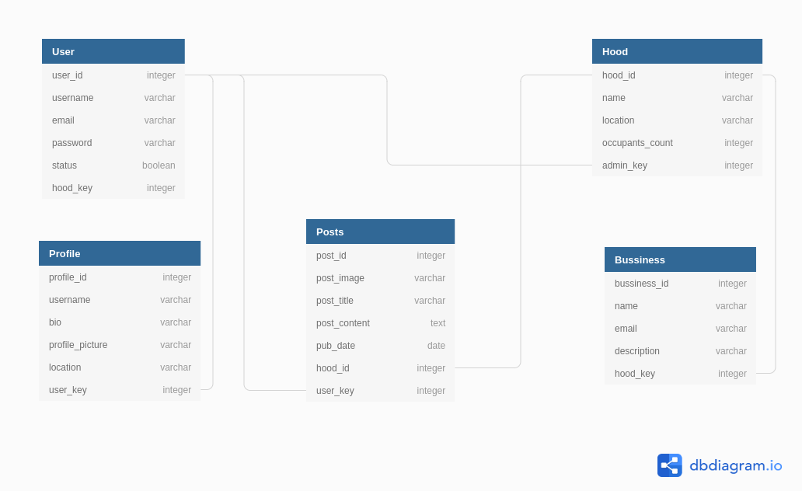

#  Awards App.
This is a web app that allows users to join various neighborhoods and create posts in those neighborhoods.

##  Getting Started

###  Prerequisites and Installing
You need to install the following software to have the  Django api app running on your local machine for development and testing purposes. Instructions on how to install will also be provided next to the software.

|Software|Installation Instructions/Terminal Commands|
|----------|---------------------------|
|Python3.6|1. sudo apt-get update|
|  |         2. sudo apt-get install python3.6|
|Virtual Environment|1. pip install pipenv|
|   |2. Activate by running: pipenv shell|
|Django 3.0|pipenv install Django|
|psycopg2|pipenv install psycopg2|
|dj-database-url|pipenv install dj-database-url|
|django-cors-headers|pipenv install django-cors-headers|
|gunicorn|pipenv install gunicorn|
|python-decouple|pipenv install python-decouple|
|django rest framework|pipenv install djangorestframework|

###  Running Tests
The test classes are divided into TestAbstractUser, TestProfileClass, TestPost, TestBussiness, TestEmergencyService, HoodSerializerTest and TestHoodModel.

Once you get the development server running, run the following command:
`python3 manage.py test` which runs all the test cases one by one.

Examples of tests are given below.

####  TestAbstractUser

      def test_default_user_admin_status(self):
        self.assertEqual(self.test_user.is_admin_status, False)

The test above tests if the default user admin status is False.

      def test_change_default_user_admin_status(self):
        self.test_user.is_admin_status = True
        self.test_user.save()
        self.assertEqual(self.test_user.is_admin_status, True)

The test above tests if a the default user admin status has been updated.

####  TestProfileClass

     def test_isinstance(self):
        self.assertTrue(isinstance(self.test_profile, Profile))

The test above tests if a profile object is an instance of the Profile class.
        
    def test_save_profile(self):
        self.new_user = User(username='randomn',email='random@random.com', password='test2020')
        self.new_user.save()
        self.new_profile = Profile(bio = 'This is a new test bio', profile_picture='https://res.cloudinary.com/mutugiii/image/upload/v1583825081/gpnb9j7zld5isfk9s4he.jpg', location='Nairobi', user=self.new_user)
        self.new_profile.save_class()
        profiles = Profile.objects.all()
        self.assertTrue(len(profiles) == 2)

The test above tests if a profile was saved successfully.
        
    def test_delete_profile(self):
        self.test_profile.delete_class()
        profiles = Profile.objects.all()
        self.assertTrue(len(profiles) == 0)

The test above tests if a profile was deleted successfully.
        

####  TestHoodModel

       def test_save_hood(self):
        self.new_hood = Hood(hood_name = 'NewHood', location='Nairobi')
        self.new_hood.save_class()
        hoods = Hood.objects.all().count()
        self.assertTrue(hoods == 2)

The test above tests if a hood was saved successfully.
        
      def test_delete_hood(self):
        self.test_hood.delete_class()
        hoods = Hood.objects.all().count()
        self.assertTrue(hoods == 0)

The test above tests if a hood was deleted successfully.

####  TestPost

       def test_save_post(self):
        posts = Post.objects.all().count()
        self.assertTrue(posts == 1)

The test above tests if a post was saved successfully.
        
      def test_delete_post(self):
        self.test_post.delete_class()
        posts = Post.objects.all().count()
        self.assertTrue(posts == 0)

The test above tests if a post was deleted successfully.

####  TestBussiness

       def test_save_bussiness(self):
        bizs = Bussiness.objects.all().count()
        self.assertTrue(bizs == 1)

The test above tests if a business was saved successfully.
        
      def test_delete_bussiness(self):
        self.test_biz.delete_class()
        bizs = Bussiness.objects.all().count()
        self.assertTrue(bizs == 0)

The test above tests if a business was deleted successfully.

##  Deployment

The application was deployed to netlify.

##  Built With

*  [Django] - 3.0 (https://docs.djangoproject.com/en/3.0/)
*  HTML
*  CSS
*  Javascript

##  Contributing

Please read [CONTRIBUTING.md](https://gist.github.com/PurpleBooth/b24679402957c63ec426) for details on our code of conduct, and the process for submitting pull requests to us.

##  Authors

* **Wendy Munyasi**  (https://github.com/wendymunyasi)
* **Habiba Hassan**  (https://github.com/habibahassan)
* **Mutugi Mutuma**  (https://github.com/Mutugiii)

##  License

This project is licensed under the MIT License.

## DB Diagram

## Api Link and description

(https://hood-drf.herokuapp.com/)

On loading the link above, a 404 page is displayed with the various urls.
Select any and login with the credentials provided if asked to do so. Though I advice against using this route.

An alternative is to use **Postman** to access the api routes as the token identifier is provided directly.

## Project-Setup Instructions.

1.Open your github account and search for github username: **wendymunyasi** or use this link: (https://github.com/wendymunyasi) .

1. git clone using the following links.

   link: https://github.com/wendymunyasi/hood-ip8.git

2. For Django app, set the database to your own url then run `python3 manage.py makemigrations` and `python3 manage.py migrate`.
3. Run the command `python3 manage.py runserver`.
4. Click the local host link on your terminal and navigate to the api root.
5. For the frontend app, navigate to the **hood-frontend** folder and serve it using vs code's live server extension.
6. You can now start using the app.

## BDD

| Behaviour | Input | Output |
| --------- | ------| ------ |
|On loading the app you see the landing page with login up form with a register link at the bottom of the form.| Clicking `sign up`.| You are redirected to a page where you enter your details and sign up then redirected to the login page.|
|Enter your username and password on the login page.| Clicking `login`. | You are redirected to a page where all the projects are visible.|
|Clicking `Hoods` link.| Mouse click.| You are redirected to a page with various neighborhoods displayed, each with a `Join Hood` link.|
|Clicking `Join Hood` link.| Mouse click.|You are redirected to a page where you create your profile before you join the hood.|
|Clicking the `User Hood` link on the navbar.|Mouse Click.|You are redirected to a page where you view the details of your hood and you can either `Add a Business` or `Add a Post` by clicking those links.|
|Clicking the `Profile` link on the navbar. | Mouse click. | You are redirected to a page where you view the details of your profile.|
|Clicking the `System Admin` link on the navbar.| Mouse click. | You are redirected to a page where you can enter your details and view the admin dashboard but only if you are an admin.|
|Clicking the `Sign Up` link on the navbar.| Mouse Click.| You are redirected to a page where you enter your details and sign up for the app.|
|Clicking the `Log In` link on the navbar.| Mouse Click.| You are redirected to a page where you enter your details and log in to the app.|

## The following include the list of technologies used:

**Python3.6**
**Django 3**
**Bootstrap**
**PostgreSQL**
**Django Rest Framework**
**HTML**
**CSS**
**Javascript**

## Known Bugs

The UI isn't as user friendly.

## Collaborate

To collaborate, reach us through the email addresses:
*  **wendymunyasi@gmail.com**
* **halimaadan92@gmail.com**
* **billmutuma@gmail.com**